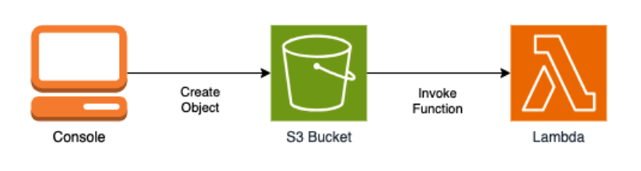

## 📦 S3 with Lambda

👉 **[View the Activity Document](https://docs.google.com/presentation/d/1vfQ0qI-G7ruC0kdGOw7oXpgSLZpcHanR/edit?usp=sharing&ouid=107817393136529843705&rtpof=true&sd=true)**

This activity demonstrates how to:  
- Automatically trigger a Lambda function when a file is uploaded to an S3 bucket.  
- Capture and inspect the event data passed to the Lambda function.  
- Update permissions to allow Lambda to write to another S3 bucket.

---

## ❓ CE12 Assignment 2.12

### Q1: What is the purpose of the execution role on the Lambda function?  

The execution role is the IAM role that the Lambda function assumes **when it runs**.  

In this activity, the execution role allows the Lambda function to:  
- 📂 Read files from the S3 bucket (so it can access the uploaded file)  
- 📝 Write logs to CloudWatch (so you can see what happened in the function)  

**💡 Key point:** The execution role controls **what the Lambda is allowed to do**.

---

### Q2: What is the purpose of the resource-based policy on the Lambda function?  

The resource-based policy is attached **directly to the Lambda function**.  

In this activity, AWS automatically added the policy when you created the S3 trigger. It allows the **S3 bucket to invoke the Lambda** whenever a file is uploaded to the configured prefix (`uploads/`).  

**💡 Key point:** Resource policy controls **who or what can trigger the Lambda**.

---

### Q3: If the Lambda function needs to upload a file into an S3 bucket, what needs to be done?  

**Q3a: Update on the execution role**  
- ✅ The execution role must have permission to **write (`PutObject`)** to the target S3 bucket.

**Q3b: Update on the resource-based policy**  
- ❌ No new resource-based policy is required. The existing S3 trigger policy already allows Lambda to run.

| Component       | What it does                  | Update for writing to S3          |
|-----------------|-------------------------------|----------------------------------|
| Execution Role  | Controls what Lambda can do   | ✅ Add permission to upload files |
| Resource Policy | Controls who can run Lambda   | ❌ Usually none needed            |

---

**💡 Key point:** Execution role = Lambda’s powers; resource policy = who can trigger Lambda.

😸 Should you want to try the activity and have trouble finding a cat photo, feel free to use this one:

